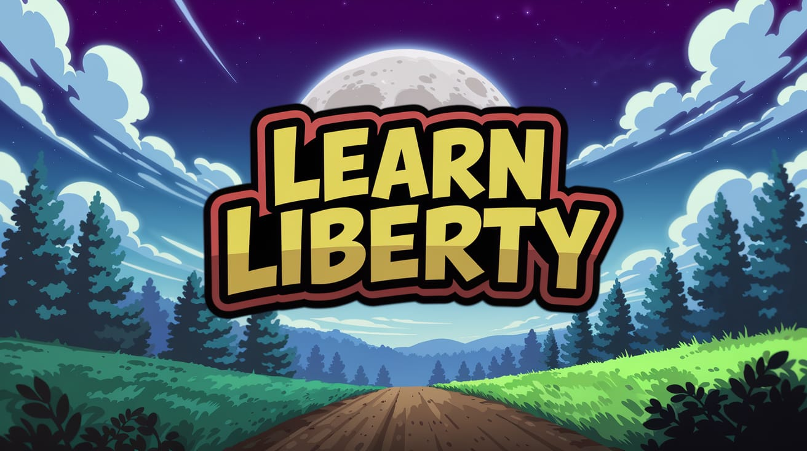

# learn-liberty

  

A very simple game, programmed in Rust, inspired by the learn by doing example of the famous Handmade Hero by Casey Muratori. This goal for this game is to be a simple 2d four way scroller RPG.
